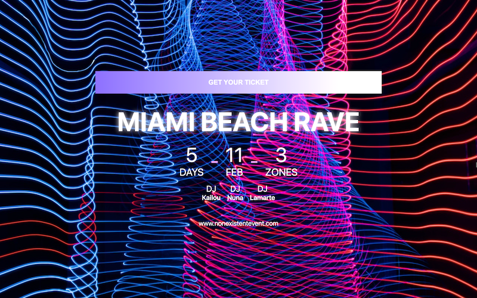

# MIAMI-BEACH-RAVE (full-stack MERN)

Event selling platform where Miami Beach Rave guests may purchase their virtual ticket utilizing Stripe, and receive it as a QRCode via Email.

[LIVE MVP DEV HERE](https://miamibeachrave.onrender.com/)



---

## The Story:

While running Jest Tests for a different application, boredom kicked in and I needed a way to debrief a little from it. Along came the idea for a quick build: Event selling.

## The Results

Full stack app, with security taken into account:

- Secured HTTP Headers
- Rate limit against Brute force attacks
- Data sanitization against NOSQL Query Injection
- Preventing params/query polution
- Encryption and Cookies httpOnly
- Protection against XSS

Email integration with sendgrid and nodemailer

QRCode generation for each "guest/ticket"

## Compromises:

- No focus on UI although current MVP is desktop and mobile

## Tech Stack

- Frontend
  - React
  - CSS
- Backend
  - NodeJS
  - Express.js
- Database
  - MongoDB: mongoose applied

## What's next

- Secured route for a authorized worker to scan and mark the ticket as "used"

## Running it

- Fork/Clone this project
- `.env` example:

```
NODE_ENV=development or production
DB_URI=YourURI
GRID_USERNAME=sendgridusername
GRID_PASSWORD=sendgridpassword
EMAIL: some@email.com
STRIPE_KEY: your_secret_key
```

- Run `npm install` at the root to install server dependencies
- `cd client` && `npm install` to install client dependencies
- At the root, `npm run dev` to start the API
- `npm run dev-client` to start the client
